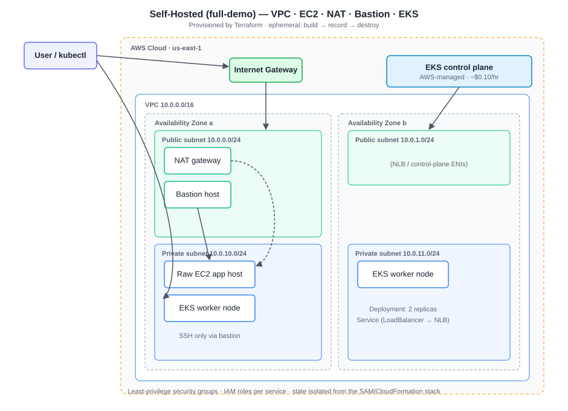

# StockSense AI

StockSense AI is a deployed inventory forecasting app for restaurant stock management. It combines a FastAPI backend, a trained scikit-learn model, inventory guardrails, and a static frontend — deployed on AWS **two different ways**: a serverless/managed-services stack and a self-hosted infrastructure-as-code stack.

**Live app:** [https://d321ncqj1ylu8d.cloudfront.net/](https://d321ncqj1ylu8d.cloudfront.net/)

---

## Two Deployment Models

The same FastAPI service ships through two deployment paradigms, demonstrating range across both managed and self-managed infrastructure:

| | Serverless (live) | Self-hosted (IaC) |
|---|---|---|
| **Provisioning** | AWS SAM (CloudFormation) | Terraform |
| **Compute** | Lambda (container image) | EC2 in a custom VPC · EKS (Kubernetes) |
| **Networking** | API Gateway + CloudFront + S3 | Hand-authored multi-AZ VPC, public/private subnets, NAT, bastion |
| **Entry image** | `backend/Dockerfile` (Lambda runtime) | `backend/Dockerfile.server` (uvicorn) |
| **Lifecycle** | Always on, ~$1–4/mo | Ephemeral build→record→destroy (~$0), optional always-on link (~$5/mo) |
| **Lives in** | `template.yaml` | [`infra/`](infra/) |

Both run the **same application code**. Each deployment self-identifies via the `DEPLOYMENT` env var, surfaced at `GET /health` (`"serverless"` vs `"self-hosted"`), so you can prove which infrastructure served a request.

- **Serverless** is the always-live, low-cost production deployment (the link above).
- **Self-hosted** exists to demonstrate traditional cloud infrastructure skills — VPC networking, EC2, IAM/security groups, Terraform, and Kubernetes. It ships primarily as **readable IaC code + a recorded walkthrough** rather than a permanently-running cluster, keeping steady-state cost at ~$0. See [`infra/README.md`](infra/README.md).

> Why two? The serverless build proves managed-services fluency; the self-hosted build proves traditional infrastructure-as-code. Together they cover both paradigms hiring managers evaluate for. The design tradeoffs are documented in [`infra/docs/`](infra/docs/).

---

## What It Does

- Predicts recommended reorder quantities for restaurant inventory items.
- Combines ML predictions with rule-based inventory safeguards for reorder level, current stock, lead time, waste, and whole-unit items such as eggs.
- Provides an inventory chatbot for reorder forecasts, waste guidance, and prediction explanations.
- Shows field-level info popovers explaining how each input affects the recommendation.
- Runs locally as a FastAPI app; deploys serverlessly on AWS (Lambda, API Gateway, S3, CloudFront, ECR, CloudWatch, SAM) and self-hosted via Terraform (VPC, EC2, EKS).

---

## Architecture

### Serverless (live)

```text
User Browser
  -> CloudFront -> Private S3 static frontend

Frontend JavaScript
  -> API Gateway HTTP API
  -> Lambda container image (FastAPI + Mangum)
  -> scikit-learn hybrid model + inventory CSV

Operations
  -> CloudWatch logs (14-day retention)
  -> API Gateway throttling
  -> Tagged AWS resources for budget tracking
```

### Self-hosted (Terraform)

```text
Full-demo environment (ephemeral: build -> record -> destroy)
  Multi-AZ VPC
    Public subnets  -> Internet Gateway, NAT gateway, bastion host
    Private subnets -> raw EC2 app host (SSH via bastion only)
                    -> EKS managed node group
  EKS cluster
    -> Deployment (2 replicas, rolling updates, /health probes)
    -> Service (type LoadBalancer -> NLB)
    -> runs backend/Dockerfile.server container

Live environment (optional, always-on ~$5/mo)
  Lightsail instance (bundled static IP)
    -> Docker container + Caddy (automatic HTTPS)
    -> selfhosted.<your-domain>
```



Full details, module layout, and cost math: [`infra/README.md`](infra/README.md).

---

## ML Approach

The model was reworked from a direct reorder-quantity regressor into a hybrid inventory system:

```text
operational minimum = reorder level - projected stock after lead time
projected stock = current stock - daily usage * lead time
waste-adjusted minimum = operational minimum adjusted by expected waste
final recommendation = max(operational minimum, operational minimum + ML adjustment)
```

The training workflow keeps controlled noisy labels to simulate messy real-world inventory data, but clips impossible negative targets. It compares multiple regressors and currently saves a HistGradientBoostingRegressor-based pipeline that predicts demand adjustment above the operational minimum. Candidate model metrics are logged with MLflow (local, ignored artifacts).

---

## Repository Layout

```text
backend/
  main.py               FastAPI routes, Lambda handler, prediction logic
  ml_features.py        Reusable inventory feature engineering
  settings.py           Environment-driven config (incl. DEPLOYMENT identifier)
  Dockerfile            Lambda container image (serverless)
  Dockerfile.server     uvicorn web-server image (self-hosted EC2/EKS/Lightsail)
  requirements.txt      Runtime dependencies
  requirements-dev.txt  Test/training dependencies

frontend/
  index.html            Static app
  script.js             API calls and UI behavior
  style.css             Responsive styling

model/
  reorder_model_tuned.pkl
  restaurant_inventory_with_targets.csv
  train_model.py / train_model.ipynb / generate_notebook.py

infra/                  Self-hosted deployment (Terraform / VPC / EC2 / EKS)
  terraform/modules/    Hand-written: vpc, ec2, nat-bastion, eks, lightsail
  terraform/environments/
    live/               Optional always-on Lightsail host (~$5/mo)
    full-demo/          VPC + EC2 + NAT + bastion + EKS (build -> record -> destroy)
  k8s/                  Hand-written Deployment + Service manifests
  docs/                 Cost breakdown, production-EC2 writeup, recording
  scripts/              deploy-live.sh, destroy-full-demo.sh

.github/workflows/
  terraform-ci.yml      fmt/validate/tflint on PR, apply-on-merge (live env)

template.yaml           AWS SAM infrastructure (serverless)
tests/                  API smoke and regression tests
```

---

## Local Development

Run the backend:

```powershell
.\venv\Scripts\python.exe -m uvicorn backend.main:app --reload
```

API docs at `http://localhost:8000/docs`. Useful endpoints:

- `GET /health` — status + which deployment is serving
- `GET /items`
- `POST /predict`
- `POST /chat`

Serve the frontend locally:

```powershell
.\venv\Scripts\python.exe -m http.server 8080 --directory frontend
```

Then open `http://127.0.0.1:8080`. The deployed frontend calls the live API Gateway endpoint.

### Run the self-hosted container locally

```bash
docker build -f backend/Dockerfile.server -t stocksense-server .
docker run -p 8000:8000 -e DEPLOYMENT=self-hosted stocksense-server
curl localhost:8000/health   # -> {"status":"ok","deployment":"self-hosted",...}
```

---

## Run Tests

```powershell
.\venv\Scripts\python.exe -m pip install -r backend\requirements-dev.txt
.\venv\Scripts\python.exe -m pytest
```

---

## Training

```powershell
.\venv\Scripts\python.exe model\train_model.py       # train + save model
.\venv\Scripts\python.exe model\generate_notebook.py # regenerate the notebook
```

---

## Deployment

### Serverless (AWS SAM)

Deployed with AWS SAM using a Lambda container image.

```powershell
sam validate
sam build
sam deploy --parameter-overrides AllowedCorsOrigins=https://d321ncqj1ylu8d.cloudfront.net
```

Upload frontend assets and invalidate the CDN after changes:

```powershell
aws s3 sync frontend s3://stocksense-ai-frontendbucket-mzzorrfadafi --delete
aws cloudfront create-invalidation --distribution-id YOUR_DISTRIBUTION_ID --paths "/*"
```

### Self-hosted (Terraform)

The full-demo environment stands up the complete VPC/EC2/EKS stack, then tears it down:

```bash
cd infra/terraform/environments/full-demo
cp terraform.tfvars.example terraform.tfvars   # fill in your values
terraform init
terraform apply
# ...apply infra/k8s manifests, exercise the cluster, record the walkthrough...
../../../scripts/destroy-full-demo.sh          # tear down immediately after
```

The optional always-on Lightsail link lives in `infra/terraform/environments/live/`. See [`infra/README.md`](infra/README.md) for the full workflow.

---

## Production Controls

**Serverless**
- API Gateway HTTP API throttling.
- CORS restricted to the CloudFront frontend domain.
- FastAPI adapted to Lambda with `Mangum(app, lifespan="off")`.
- CloudWatch log retention set to 14 days.
- Resources tagged `Project=StockSenseAI`, `Environment=Production`.

**Self-hosted**
- Least-privilege security groups; app EC2 in a private subnet, SSH only via the bastion.
- IAM roles scoped per-service (EKS cluster, node group, ECR-pull instance profile).
- Terraform state kept fully separate from the SAM/CloudFormation stack.
- Resources tagged `Project=StockSenseAI-Infra` for isolated billing.
- Changes gated by CI (`terraform fmt`/`validate`/`tflint` + plan on PR).

---

## Cost Notes

Designed as a low-cost portfolio project.

| Layer | Cost |
|---|---|
| Serverless (always live) | ~$1–4/month |
| Self-hosted full-demo | ~$0 steady-state; <$0.50 per record session |
| Self-hosted live link (optional Lightsail) | ~$5/month |

Budget controls:
- Account-wide AWS budget at `$10/month`.
- Project-specific budgets via the `Project` / `Project=StockSenseAI-Infra` cost allocation tags.
- ECR lifecycle cleanup to keep only recent container images.
- No NAT Gateway, EKS control plane, or ALB left running 24/7 (see [`infra/docs/cost-breakdown.md`](infra/docs/cost-breakdown.md)).

Full cost reasoning and the "what a production EC2 deployment would add" writeup: [`infra/docs/`](infra/docs/).
